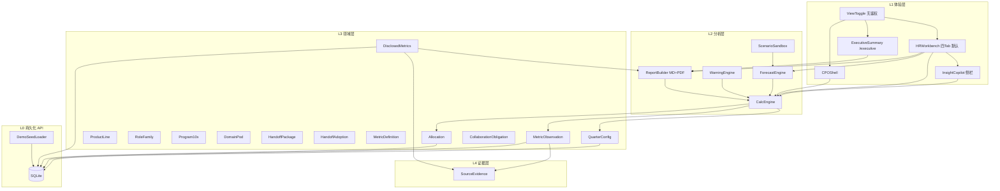

# 某大模型公司战略人效核算台 — 产品架构 v2.1

> **产品代号（英文）**：**STRIDE** — Strategic Talent ROI & Investment Decision Engine  
> **中文工作名**：某大模型公司战略人效核算台  
> **配套 PRD**：[02-requirements/PRD-v1.2.md](../02-requirements/PRD-v1.2.md)（HR 工作台 + Copilot + Forecast）  
> **UX 北极星**：[Netlify HRBP 原型](https://warm-squirrel-e57666.netlify.app/) · Executive 仅见 `mockups/stride-home-executive.html`  
> **专访**：[01-discovery/interviews-product-lines.md](../01-discovery/interviews-product-lines.md) · [interview-synthesis.md](../01-discovery/interview-synthesis.md)  
> **索引**：[docs/README.md](../README.md)

## 1. 架构原则

1. **证据优先**：无 SourceEvidence 的披露字段不得进入 Executive 报告
2. **双通道隔离**：DisclosedMetrics ≠ MetricObservation
3. **配置可追溯**：QuarterConfig 快照不可原地覆盖
4. **角色分 Shell（无鉴权）**：同引擎，**默认 HRBP 工作台**；Executive 为 `/executive` 摘要子路由，MVP 不做登录与 RBAC  
5. **同源问数**：InsightCopilot 与图表仅读 CalcSnapshot + MetricDefinition，禁止游离口径  
6. **可解释预测**：ForecastEngine 输出假设清单与区间，MVP 不做黑箱 ML

## 2. 逻辑架构图

## 3. 模块职责

| 模块 | 职责 |
|------|------|
| QuarterConfig | 季度、主投能力、权重、audit_log、snapshot_id |
| ProductLine | P1–P6, stage, capability 绑定 |
| RoleFamily | 9 岗位族（含 RF09 10x）, cost_coefficient |
| Program10x | 横切 X10；非 ProductLine；50% P6 + 50% 绑定 PL |
| DomainPod | 领域 Pod（金融/工业软件/芯片等）→ bound_pl |
| HandoffPackage | 10x 交接包；验收标准、局限、handoff_id |
| HandoffAdoption | 采纳登记；`source:10x-handoff-{id}`；供 D3b |
| CollaborationObligation | 各 RF 支撑/采纳承诺与完成率 |
| Allocation | 岗位×产品线矩阵, 行和=100%；RF09 与 70% P6 规则分列 |
| MetricDefinition | 指标字典 C1–C7 + X10，CSV 导入 |
| MetricObservation | 代理产出, source_type |
| DisclosedMetrics | 年报字段: 收入、海外占比、员工成本等 |
| HRWorkbench | 四 Tab：总览/成本/组织/薪酬绩效；TCOW 等 HR KPI；**默认路由 /** |
| InsightCopilot | Chat-to-BI：意图→白名单查询→回答+citation；`copilot_query_log` |
| ForecastEngine | 下季 TCOW/Labor Cost%/ROI 区间；三档假设 |
| ScenarioSandbox | 编制增量、权重调整、调薪沙盘参数 → 调 ForecastEngine |
| CalcEngine | 投入/TCOW/人效指数/能力ROI/Rev/FTE/Labor Cost% |
| WarningEngine | W1–W5（MVP）；**W6–W11**（10x）；**stage 规则集** |
| ReportBuilder | **hrbp 默认** \| executive 摘要；Markdown + PDF |
| DemoSeedLoader | 加载 2025Q2–Q4 + HR KPI 占位 |

## 4. 数据流

1. 用户完成向导 1–3 → API 写入 QuarterConfig + Observation + Evidence → SQLite
2. `POST /api/quarters/{id}/calculate` → CalcEngine 读快照 → CalcSnapshot 落库
3. WarningEngine 读当前 + 上季 Snapshot → warnings[]
4. ReportBuilder 合并 DisclosedMetrics + CalcSnapshot → Markdown / PDF 流  
5. `POST /api/copilot/ask` → InsightCopilot 读 snapshot → 回答 + citations  
6. `POST /api/forecast/scenario` → ForecastEngine → bands + assumptions

## 5. API 边界（SQLite 轻后端）

| 方法 | 路径 | 说明 |
|------|------|------|
| GET | `/api/quarters` | 列表（含 Demo 种子季） |
| GET | `/api/quarters/{id}` | 季度配置 + 关联实体 |
| PUT | `/api/quarters/{id}` | 更新战略配置（写新 snapshot_id） |
| POST | `/api/quarters/{id}/calculate` | 触发核算 |
| GET | `/api/quarters/{id}/snapshot` | 最近 CalcSnapshot |
| GET | `/api/quarters/{id}/warnings` | 预警列表 |
| POST | `/api/quarters/{id}/report?type=executive\|hrbp&format=md\|pdf` | 报告导出 |
| POST | `/api/demo/seed` | 重置/加载 Demo 三季（幂等） |
| GET | `/api/metrics/definitions` | 指标字典 |
| GET | `/api/allocation/templates/default` | 默认分摊矩阵（含 RF09、domain_pods） |
| GET | `/api/x10/handoffs?quarter={id}` | Handoff 列表（v1.2） |
| POST | `/api/x10/handoffs` | 创建/更新 Handoff（v1.2） |
| POST | `/api/x10/adoptions` | 采纳登记（v1.2） |
| GET | `/api/x10/collaboration?quarter={id}` | 协作义务完成率（v1.2） |
| POST | `/api/copilot/ask` | Chat-to-BI（question → answer + citations） |
| POST | `/api/forecast/scenario` | 情景预测（编制/权重/营收敏感/调薪） |
| GET | `/api/hr/kpis?quarter={id}` | TCOW、Rev/FTE、Labor Cost%、编制达成 |

**实现要点**
- ORM：Drizzle 或 Prisma + `better-sqlite3`（单文件 `data/stride.db`）
- 迁移：schema 版本与 `QuarterConfig.snapshot_id` 对齐
- 客户端：Next.js Route Handlers 同仓部署，无独立微服务
- MVP **无** auth middleware；视图切换仅前端状态 + 可选 `?view=executive` query

## 6. 产品线默认 stage（Demo 2025Q3）

| PL | stage | 说明 |
|----|-------|------|
| P1 星野 | grow | C 端收割期 |
| P2 海螺 | grow | 多模态主力 |
| P3 Audio | explore | 探索期降预警 |
| P4 视频 | grow | 与海螺协同 |
| P5 API | grow | 商业化 |
| P6 中台 | grow | 赋能全线；无收入人效 |

## 7. 技术栈

- **前端**：Next.js 14 App Router, TypeScript strict, ECharts
- **状态**：Zustand 或 React Query（服务端状态以 API 为准）
- **后端**：Next.js Route Handlers + SQLite（`better-sqlite3` / Drizzle）
- **报告**：Markdown 模板 + `@react-pdf/renderer` 或 Puppeteer PDF（MVP 择一）
- **种子数据**：[allocation-default.json](../02-requirements/allocation-default.json) + [metrics-dictionary.csv](../02-requirements/metrics-dictionary.csv) + `scripts/seed-demo.ts`
- **部署**：作品集 — Vercel 或单机 `npm run build && npm start`

## 8. 与 v2.0 差异摘要

| 项 | v2.0 | v2.1 |
|----|------|------|
| 持久化 | localStorage 为主 | **SQLite API 为默认** |
| 鉴权 | 角色 Shell 暗示权限 | **无鉴权**，视图切换 |
| 报告 | Markdown | **Markdown + PDF** |
| 专访 | PRD 缩写 | **01-discovery/** 全文 |

## 9. 10x 预警 W6–W11（v1.2）

| ID | 规则摘要 |
|----|----------|
| W6 | 10x 投入 QoQ↑>10%，D3b 采纳数不增 |
| W7 | 模型/中台发布≥1，绑定 PL major=0 且 linkage 含 10x |
| W8 | Handoff 完成，绑定 RF 采纳=0 |
| W9 | RF 承诺支撑完成率 <80% |
| W10 | 全公司 10x 投入↑，全公司采纳总数↓ |
| W11 | PL 参加评审但路线图无 10x 标签 |

→ 细则：[10x-team-assessment-framework.md](../02-requirements/10x-team-assessment-framework.md)

## 10. 相关文档

- 10x 程序：[10x-team-program.md](../00-background/10x-team-program.md)
- Demo 种子字段清单：[04-demo/demo-seed-plan.md](../04-demo/demo-seed-plan.md)
- 埋点计划：[event-tracking-plan.md](./event-tracking-plan.md)
