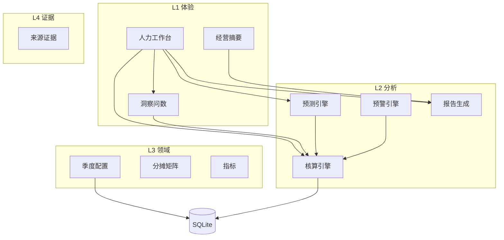

# 某大模型公司战略人效核算台 — 产品需求文档 v1.3

> **英文代号**：**STRIDE** — *Strategic Talent ROI & Investment Decision Engine*  
> **中文工作名**：某大模型公司战略人效核算台（对外不出现具体公司品牌）  
> **数据性质**：基于上市大模型公司 **公开信息** 的推演模型，非官方 HR/财务数据。  
> **业务背景**：[business-narrative.md](../00-background/business-narrative.md)（行业—企业—HR—方法论，本文仅写 **产品要求**）  
> **架构附录**：本文 [附录 A](#附录-a-产品架构)；独立维护 [architecture-v2.1.md](../03-architecture/architecture-v2.1.md)

**上一版**：[PRD-v1.2.md](./PRD-v1.2.md)（已 supersede）

---

## 1. 产品定义

### 1.1 我们要解决什么

多产品线 AI 公司的人力资源部门，日常面对的不是「缺一张报表」，而是五类专业困境（详见业务叙事第五节）：

- **成本**：人力总成本与人力成本占营收比说不清结构、说不清归属；  
- **效率**：业务、人力、财务各用各的指标；  
- **编制**：计划、达成与战略主投脱节；  
- **激励**：薪酬×绩效只能在个案层讨论，缺少聚合叙事；  
- **协同成本**：中台分摊与横切项目投入难以审计；  
- **节奏**：临时问数慢，编制会前缺少可解释的情景试算。

STRIDE 的定位是：**人力资源业务伙伴（HRBP）默认可用的季度人力洞察工作台**——先把人力分析站稳，再在同一套数据上叠加 **战略能力 × 产品线 × 岗位族** 的编制视图；经营层摘要仅为 **同源导出**，不是另一套故事。

### 1.2 产品一句话

**人力洞察工作台**（四 Tab + 问数 + 情景试算）+ **战略季编制核算**（向导 + 分摊矩阵 + 预警）+ **经营摘要**（单屏、可导出）。

### 1.3 设计原则

| 原则 | 要求 |
|------|------|
| **人力优先** | 首屏是人力总成本、人均营收、人力成本占营收比、编制达成与组织信号，不是董事会投资回报率大屏 |
| **简易可演示** | 范围控制在「能讲清方法论、能走通一季数据」；优先规则化问数与透明公式预测，不追求对接完整人力资源信息系统 |
| **同源口径** | 图表、问数助手、报告、摘要共用同一份 **核算快照**；禁止未入库字段出现在回答中 |
| **双通道** | **披露数据**与**业务推演数据**分开展示；推演数据不得冒充披露进入经营摘要 |
| **可审计** | 季度快照不可覆盖；关键字段可挂证据；假设占比过高强制水印 |
| **非裁员工具** | 不输出个人末位排名进经营摘要；薪酬分析仅聚合，小样本脱敏 |

### 1.4 成功标准（验收）

| 维度 | 标准 |
|------|------|
| 可用性 | HR 业务伙伴测试用户 5 分钟内能说出：本季人力总成本趋势、2 个组织信号、1 条编制相关结论 |
| 问数 | 内置 ≥8 条标准问法，回答 100% 带字段来源（披露 / 推演 / 假设） |
| 预测 | 至少支持 **编制增量**、**主投权重调整** 两类情景，输出区间 + 假设清单 |
| 演示 | 15 分钟内完成：工作台浏览 → 一次问数 → 一次情景 → 导出 HR 报告 → 查看经营摘要 |
| 战略 | 产出指标可挂载七项战略能力（第七项「垂直产业 10×」可选）；分摊矩阵行和 100% |

---

## 2. 用户与典型场景

### 2.1 用户（按优先级）

| 优先级 | 角色 | 主要场景 |
|--------|------|----------|
| 第一 | **人力资源业务伙伴（HRBP）** | 季中监控成本与编制；编制会持表；向首席人才官 / 财务对齐口径 |
| 第二 | **首席人才官（CPO）** | 看产品线生命周期阶段、主投能力、模型与产品联动预警 |
| 第三 | **财务 / 经营层** | 读披露相关关键指标与一页摘要（只读） |
| 第四 | **产品线负责人** | 查看本线投入与产出推演（只读） |

本期 **不做** 登录与权限体系；通过顶栏切换「人力业务伙伴 / 首席人才官 / 经营层」视图。

### 2.2 典型场景（用户故事摘要）

1. **季中**：HR 业务伙伴打开总览，发现某产品线人力成本占营收比环比上升，用问数助手追问「是否因在岗人数增加」并跳转成本 Tab。  
2. **编制会前**：在组织 Tab 调整「向海螺产品线增加 10 名工程编制」沙盘，查看下季人力总成本与人力成本占营收比区间。  
3. **季末**：走完向导录入全职当量、分摊与产出推演，触发核算，导出 HR 详版报告；经营摘要自动生成。  
4. **探索期产品线**：对语音等探索期产品线预警降敏，文案标明「非裁编依据」。

---

## 3. 功能需求

### 3.1 HR 工作台（默认首页 `/`）

与业务叙事 6.4 节能力域对齐；**四 Tab 为本期必交付**。

| Tab | 路由 | 必含能力 | 对应业务痛点 |
|-----|------|----------|--------------|
| **总览** | `/` | 人力总成本、人均营收、人力成本占营收比、编制达成；营收 vs 人力总成本走势；各产品线人均营收对标；**问数侧栏** | 成本与效率口径分裂 |
| **成本** | `/cost` | 人力总成本结构（固定/浮动/法定/福利）；产品线/部门成本表；预算偏离标签 | 成本结构不清 |
| **组织** | `/org` | 编制达成、管理幅度、关键岗空缺、离职率；**编制/调薪沙盘入口**；跳转向导 2 | 编制与预测 |
| **薪酬×绩效** | `/pay-performance` | 高绩效占比 vs 高绩效薪酬占比（聚合）；策略提示；免责文案 | 薪酬叙事弱 |

**关键指标定义**（实现层代码与口径详见 [metrics-dictionary.csv](./metrics-dictionary.csv)）：

| 界面用语 | 含义 |
|----------|------|
| **人力总成本** | 当季全公司人力总成本（推演汇总）。 |
| **人力成本占营收比** | 人力总成本 ÷ 营收（分披露通道与推演通道）。 |
| **人均营收** | 营收（或推演营收）÷ 全职当量。 |
| **编制达成率** | 实际在岗人数 ÷ 计划编制人数（推演须标注）。 |

### 3.2 洞察问数（Insight Copilot）

| 项 | 要求 |
|----|------|
| 实现 | **规则 + 模板** 优先：意图 → 白名单指标查询 → 自然语言总结 |
| 位置 | 总览 Tab 侧栏；可选全屏 `/insight` |
| 回答 | 结论 + 数值 + 季度 + **来源类型** + 跳转 |
| 拒绝 | 缺证据或假设占比过高时，不给虚假精确数 |
| 审计 | 记录问题原文、意图、快照编号、指标代码 |

**本期至少支持 8 类问法**（可扩展至 12），例如：人力总成本同比、人力成本占营收比最高的产品线、编制达成率最低、某战略能力投资回报率、当前活跃预警含义等。

### 3.3 情景试算（预测）

| 情景 | 输入 | 输出 |
|------|------|------|
| 编制增量 | 新增全职当量 × 岗位族 × 目标产品线 | 下季人力总成本变化、人力成本占营收比变化（乐观/基准/保守三档） |
| 主投权重调整 | 七项战略能力权重变更 | 各能力投资回报率变化、可能触发的预警提示 |
| 调薪沙盘（简化） | 调薪比例滑块 | 增量人力总成本、人力成本占营收比变化 |

输出须附 **假设清单**；禁止黑箱机器学习承诺精度。

### 3.4 战略季向导与核算

| 向导 | 内容 | 必含 |
|------|------|------|
| **向导 1** | 季度、主投能力权重、各产品线生命周期阶段、披露/推演字段确认 | 七项战略能力权重快照 |
| **向导 2** | 九个岗位族全职当量；分摊矩阵（行和 100%）；「基础模型与中台」入口 70% 规则可配置 | 默认 [allocation-default.json](./allocation-default.json) |
| **向导 3** | 产出推演与证据；双通道录入 | 来源类型必填 |

**核算输出**（能力坐标系见 [strategic-context.md](../00-background/strategic-context.md)）：

- 岗位投入、公司人力总成本、人效指数（HR 业务伙伴视图）；  
- 战略能力投资回报率、产品线人效（战略视图 `/strategic`）；  
- 五类标准预警（按产品线阶段降敏，见 §5 预警表）。

### 3.5 视图与报告

| 视图 | 首屏重点 | 隐藏 |
|------|----------|------|
| 人力业务伙伴 | 工作台四 Tab | — |
| 首席人才官 | 能力投资回报率、阶段、联动、**模型发布与产品版本脱节**预警 | 个案薪酬 |
| 经营层 | 披露杠杆、主投能力摘要、**一条** 决策建议、固定免责声明 | 岗位末位、个案 |

| 报告 | 格式 | 说明 |
|------|------|------|
| HR 详版 | Markdown；PDF 可选 | 含来源附录、分摊矩阵 |
| 经营摘要 | Markdown；PDF 可选 | 与 HR 报告 **同源** 核算快照 |

### 3.6 本期不做（范围外）

- 对接真实人力资源信息系统、薪酬发放、考勤、绩效流程；  
- 多租户、账号权限、审批流；  
- 未经审核的大模型自动生成披露数据；  
- 投资者关系式营销首页；  
- 个案级绩效排名与裁编建议。

### 3.7 后续扩展（不阻塞本期）

| 模块 | 说明 |
|------|------|
| 10× 横切项目 | 交接包、采纳登记、扩展预警、协作分（见 [10x-team-program.md](../00-background/10x-team-program.md)） |
| 问数大模型意图扩展 | 在规则稳定后接入 |
| 完整调薪沙盘 | 与薪酬系统口径对接时再扩展 |

---

## 4. 页面与路由

```text
/                     → 工作台 · 总览（默认）
/cost                 → 工作台 · 成本
/org                  → 工作台 · 组织
/pay-performance      → 工作台 · 薪酬×绩效
/insight              → 问数（可选全屏）
/scenario             → 情景试算
/wizard/1 | 2 | 3     → 战略配置 / 组织投入 / 产出证据
/strategic            → 能力投资回报率、产品线、预警列表
/executive            → 经营摘要（单屏）
/report               → 报告导出
/settings             → 指标字典、默认模板、演示数据加载
```

顶栏：`人力业务伙伴 | 首席人才官 | 经营层`，默认 **人力业务伙伴**。

---

## 5. 数据与规则（摘要）

完整公式与坐标系见 [strategic-context.md](../00-background/strategic-context.md)。

```text
岗位投入 = 全职当量 × 13周 × 岗位成本系数 × 分摊%
人力总成本 = Σ 岗位投入
人力成本占营收比 = 人力总成本 / 营收（分通道）
人效指数 = Σ(产出×战略权重) / 投入 × 100
```

### 5.1 五类标准预警（本期）

| 预警名称 | 触发逻辑（简述） |
|----------|------------------|
| **投入升、产出降** | 投入环比升、产出 proxy 环比降（探索期产品线降敏） |
| **主投能力回报偏低** | 主投战略能力投资回报率低于公司中位数 |
| **投入与战略权重偏离** | 岗位投入占比 vs 战略权重偏离超过 15 个百分点 |
| **模型与产品版本脱节** | 基础模型有发布记录，绑定产品线无 major 版本 |
| **收入与投入结构倒挂** | 收入占比升、人力投入占比降 |

### 5.2 来源分级

**披露数据** > **业务推演数据** > **假设数据**（须备注）。假设占比超过 30% 时报告加水印。

---

## 6. 数据工件

| 文件 | 用途 |
|------|------|
| [metrics-dictionary.csv](./metrics-dictionary.csv) | 指标代码与口径（实现用，界面展示中文名） |
| [allocation-default.json](./allocation-default.json) | 默认分摊、岗位族、协作矩阵 |
| [demo-seed-plan.md](../04-demo/demo-seed-plan.md) | 演示季 2025Q2–Q4 字段计划 |
| [user-decisions.md](./user-decisions.md) | 已关闭的产品决策 |

---

## 7. 需求追溯

| 需求编号 | 摘要 | 优先级 |
|---------|------|--------|
| 人力工作台-04～08 | 四 Tab、关键指标、问数、预测、沙盘 | 本期必做 |
| 人力工作台-01～03 | 三维矩阵、来源分级、季度趋势 | 本期必做 |
| 财务披露-01～04 | 披露通道隔离 | 本期必做 |
| 首席人才官-01～04 | 阶段、联动、权重模板 | 本期应做 |
| 经营摘要-01～03 | 摘要、无末位、免责 | 本期应做 |
| 10× 横切-* | 10× 模块 | 后续 |

访谈与冲突裁决：[interview-synthesis.md](../01-discovery/interview-synthesis.md)

---

## 8. 非功能需求（精简）

| 项 | 要求 |
|----|------|
| 性能 | 问数规则路径响应 &lt;3 秒 |
| 文案 | 中文 HR 术语；主界面避免金融营销腔 |
| 隐私 | 薪酬仅聚合；样本量小于 5 不展示 |
| 部署 | 单机可运行：Next.js + SQLite 文件库 |

---

## 附录 A. 产品架构

> **说明**：本节为 PRD 附录，便于评审一次读全。技术细节、模块表、接口清单以独立文档为准，并与本文保持同步：  
> **[architecture-v2.1.md](../03-architecture/architecture-v2.1.md)**  
> 实现层仍可使用英文模块名与指标 `code`（见指标字典），**产品文案与 PRD 正文以中文全称为准**。

### A.1 架构原则

1. **证据优先** — 无证据的披露字段不进经营摘要。  
2. **双通道隔离** — 披露指标与推演观测分实体存储。  
3. **快照不可变** — 季度配置按快照编号版本化，禁止原地覆盖。  
4. **默认人力工作台** — 经营摘要为 `/executive` 子路由。  
5. **同源问数与预测** — 问数助手与情景试算只读核算引擎产出。

### A.2 逻辑分层

```text
L1 体验层     人力工作台（四 Tab）| 首席人才官视图 | 经营层摘要 | 问数侧栏
L2 分析层     核算引擎 | 预警引擎 | 预测引擎 | 报告生成
L2b 智能层    洞察问数 | 情景沙盘
L3 领域层     季度配置、产品线、岗位族、分摊、指标
L4 证据层     来源证据
L0 持久化     SQLite（data/stride.db）+ 演示数据加载器
```



### A.3 核心模块（摘要）

| 模块 | 职责 |
|------|------|
| 人力工作台 | 四 Tab；关键指标；默认路由 |
| 洞察问数 | 意图 → 白名单查询 → 回答 + 引用来源 |
| 预测引擎 | 编制/权重/调薪情景 → 区间 + 假设清单 |
| 核算引擎 | 人力总成本、人效指数、能力投资回报率、人均营收 |
| 预警引擎 | 五类标准预警；按产品线阶段规则集 |
| 报告生成 | HR 详版 / 经营摘要 |
| 季度配置 | 季度战略配置快照 |
| 分摊矩阵 | 岗位×产品线矩阵 |

### A.4 主数据流

1. 向导 1–3 写入配置、分摊、观测值与证据 → 数据库。  
2. `POST /api/quarters/{id}/calculate` → 生成核算快照。  
3. 工作台与问数助手读取同一快照。  
4. `POST /api/copilot/ask`、`POST /api/forecast/scenario` 基于快照计算。  
5. `POST /api/quarters/{id}/report` 导出报告。

### A.5 接口清单（本期）

| 方法 | 路径 | 用途 |
|------|------|------|
| GET | `/api/quarters` | 季度列表 |
| GET/PUT | `/api/quarters/{id}` | 读/写季度配置（新版本快照） |
| POST | `/api/quarters/{id}/calculate` | 核算 |
| GET | `/api/quarters/{id}/snapshot` | 核算结果 |
| GET | `/api/quarters/{id}/warnings` | 预警列表 |
| GET | `/api/hr/kpis?quarter={id}` | 工作台关键指标 |
| POST | `/api/copilot/ask` | 问数 |
| POST | `/api/forecast/scenario` | 情景试算 |
| POST | `/api/quarters/{id}/report` | 报告 |
| POST | `/api/demo/seed` | 加载演示季 |
| GET | `/api/metrics/definitions` | 指标字典 |
| GET | `/api/allocation/templates/default` | 默认分摊 |

完整表、10× 扩展接口、技术栈与部署见 **[architecture-v2.1.md](../03-architecture/architecture-v2.1.md)**。

### A.6 技术栈（本期）

| 层 | 选型 |
|----|------|
| 前端 | Next.js 14、TypeScript、ECharts |
| 后端 | Route Handlers + SQLite（`better-sqlite3` / Drizzle） |
| 报告 | Markdown 优先；PDF 可选 |
| 鉴权 | 无；仅视图切换 |

---

**STATUS: READY_FOR_BUILD** — PRD v1.3 与 [business-narrative.md](../00-background/business-narrative.md) v3.1 对齐；正文以中文全称表述指标与预警，实现代码见指标字典。

**实现顺序建议**：人力四 Tab（可静态数据）→ 数据库 schema + 关键指标接口 → 向导与核算 → 规则问数 → 两类情景试算 → 报告与 `/executive`。
