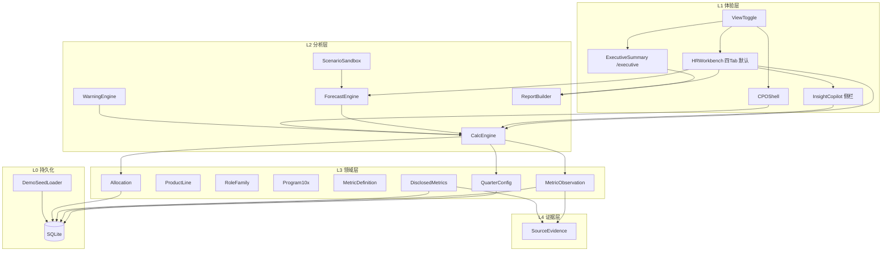

# 某大模型公司战略人效核算台 — 产品架构 v2.1

> **产品代号**：**STRIDE** — Strategic Talent ROI & Investment Decision Engine  
> **配套 PRD**：[PRD-v1.3.md](../02-requirements/PRD-v1.3.md)（**附录 A** 为架构摘要；**本文**为完整技术说明）  
> **业务背景**：[business-narrative.md](../00-background/business-narrative.md)  
> **索引**：[docs/README.md](../README.md)

---

## 与 PRD 的关系

| 文档 | 内容 |
|------|------|
| [PRD-v1.3.md 附录 A](../02-requirements/PRD-v1.3.md#附录-a-产品架构) | 评审用：原则、分层、主 API、技术栈 |
| **本文件** | 实现用：完整模块表、数据流、扩展 API、10x 与部署 |

两份文档 **同步维护**；变更 API 或分层时，须同时更新 PRD 附录 A 与本文件。

---

## 1. 架构原则

1. **证据优先**：无 SourceEvidence 的披露字段不得进入经营摘要报告。  
2. **双通道隔离**：`DisclosedMetrics` ≠ `MetricObservation`。  
3. **配置可追溯**：`QuarterConfig` 快照不可原地覆盖。  
4. **默认 HR 工作台**：Executive 为 `/executive` 子路由；本期无登录与 RBAC。  
5. **同源问数**：InsightCopilot 仅读 `CalcSnapshot` + `MetricDefinition`。  
6. **可解释预测**：ForecastEngine 输出假设清单与区间，本期不做黑箱 ML。

---

## 2. 逻辑架构图

---

## 3. 模块职责

| 模块 | 职责 |
|------|------|
| **HRWorkbench** | 四 Tab：总览 / 成本 / 组织 / 薪酬×绩效；TCOW 等 KPI；默认 `/` |
| **InsightCopilot** | Chat-to-BI：意图 → 白名单查询 → 回答 + citations；`copilot_query_log` |
| **ForecastEngine** | 编制增量、权重调整、调薪 → TCOW/Labor Cost% 区间 |
| **ScenarioSandbox** | 沙盘参数 → 调 ForecastEngine |
| **CalcEngine** | 投入、TCOW、人效指数、能力 ROI、Rev/FTE、Labor Cost% |
| **WarningEngine** | W1–W5（本期）；W6–W11（10x 扩展）；stage 规则集 |
| **ReportBuilder** | HR 详版 / Executive 摘要；Markdown + PDF（PDF 可选） |
| **QuarterConfig** | 季度、主投能力权重、audit_log、snapshot_id |
| **ProductLine** | P1–P6、stage、能力绑定 |
| **RoleFamily** | RF01–RF09（含 10x）、cost_coefficient |
| **Allocation** | 岗位×产品线矩阵，行和 100% |
| **Program10x** | 横切 X10；50% P6 + 50% 绑定 PL（扩展） |
| **MetricDefinition / Observation / DisclosedMetrics** | 指标字典与双通道数据 |
| **SourceEvidence** | url、页码、source_type |
| **DemoSeedLoader** | 2025Q2–Q4 演示数据 |

---

## 4. 数据流

1. 向导 1–3 → 写入 `QuarterConfig`、`Allocation`、`MetricObservation`、`SourceEvidence`。  
2. `POST /api/quarters/{id}/calculate` → `CalcEngine` → `CalcSnapshot` 落库。  
3. `GET /api/hr/kpis`、工作台图表 → 读 `CalcSnapshot`。  
4. `POST /api/copilot/ask` → `InsightCopilot` → citations。  
5. `POST /api/forecast/scenario` → `ForecastEngine` → bands + assumptions。  
6. `WarningEngine` 读当前与上季 snapshot → `warnings[]`。  
7. `POST /api/quarters/{id}/report` → `ReportBuilder`。

---

## 5. API 边界

### 5.1 本期（与 PRD 附录 A 一致）

| 方法 | 路径 | 说明 |
|------|------|------|
| GET | `/api/quarters` | 季度列表 |
| GET | `/api/quarters/{id}` | 季度配置 |
| PUT | `/api/quarters/{id}` | 更新配置（新 snapshot_id） |
| POST | `/api/quarters/{id}/calculate` | 触发核算 |
| GET | `/api/quarters/{id}/snapshot` | 核算结果 |
| GET | `/api/quarters/{id}/warnings` | 预警 |
| GET | `/api/hr/kpis?quarter={id}` | 工作台 KPI |
| POST | `/api/copilot/ask` | 问数 |
| POST | `/api/forecast/scenario` | 情景试算 |
| POST | `/api/quarters/{id}/report?type=hrbp\|executive&format=md\|pdf` | 报告 |
| POST | `/api/demo/seed` | 演示数据（幂等） |
| GET | `/api/metrics/definitions` | 指标字典 |
| GET | `/api/allocation/templates/default` | 默认分摊 |

### 5.2 扩展（10x 模块，后续）

| 方法 | 路径 |
|------|------|
| GET/POST | `/api/x10/handoffs` |
| POST | `/api/x10/adoptions` |
| GET | `/api/x10/collaboration?quarter={id}` |

---

## 6. 实现要点

| 项 | 说明 |
|----|------|
| ORM | Drizzle 或 Prisma + `better-sqlite3` |
| 数据库 | `data/stride.db` |
| 部署 | Next.js 同仓 Route Handlers；本地 `npm run dev` 或 Vercel |
| 鉴权 | 无；`?view=hrbp\|cpo\|executive` 或顶栏切换 |
| 种子 | [allocation-default.json](../02-requirements/allocation-default.json)、[demo-seed-plan.md](../04-demo/demo-seed-plan.md) |

---

## 7. 产品线默认 stage（演示 2025Q3）

| PL | stage |
|----|-------|
| P1 星野 | grow |
| P2 海螺 | grow |
| P3 Audio | explore |
| P4 视频 | grow |
| P5 API | grow |
| P6 中台 | grow（不算收入人效） |

---

## 8. 10x 预警 W6–W11（扩展）

| ID | 规则摘要 |
|----|----------|
| W6 | 10x 投入升、采纳不增 |
| W7 | 模型发布有、绑定 PL major 无 |
| W8 | Handoff 完成、采纳为 0 |
| W9 | 支撑完成率 <80% |
| W10 | 全公司 10x 投入升、采纳降 |
| W11 | 参加评审但路线图无 10x 标签 |

细则：[10x-team-assessment-framework.md](../02-requirements/10x-team-assessment-framework.md)

---

## 9. 相关文档

- [event-tracking-plan.md](./event-tracking-plan.md)  
- [ui-design-digital-v1.md](./ui-design-digital-v1.md)  
- [04-demo/demo-seed-plan.md](../04-demo/demo-seed-plan.md)

---

**文档版本**：v2.1 · 与 PRD v1.3 附录 A 同步
